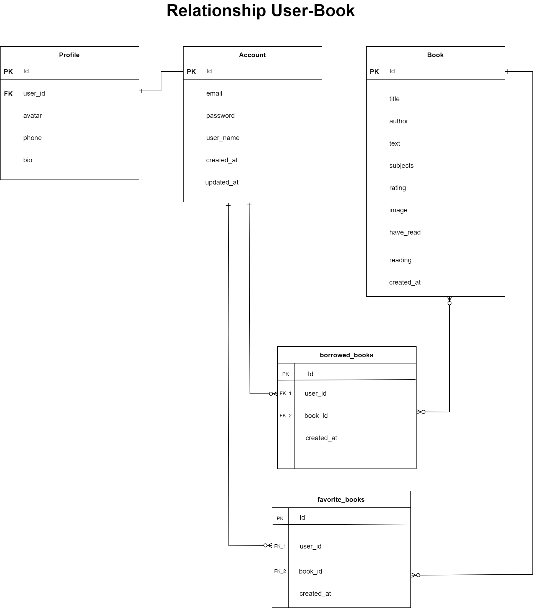
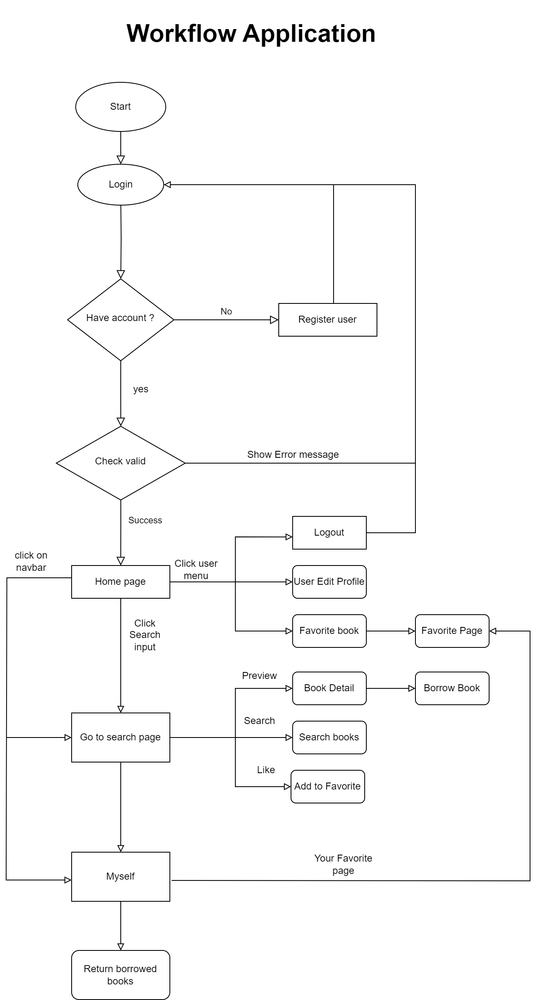

# React-training

# Big-practice: User manager

### Overview

- Design: [Figma](https://www.figma.com/file/TvvCbZ4IqnjYSBE2NQtAUt/My-Book-Shelf-CRUD)
- Plan: [Plan training](https://docs.google.com/document/d/1utuEFICCPd5t2ZV1THibslI70-vojrtBM7bCe5b8Sxk/edit?usp=sharing)

#### Database diagram

- Build a website for My Shelf Books
- Description: using available data API, user can use CRUD and search books

### Targets

- Apply HTML/CSS + SCSS
- Apply React basics
- Apply Typescript
- Apply Storybook

### Requirements

- Create app My Shelf Book
- CRUD
- Search, filter books
- Apply storybook

### Information

- Timeline

  - Estimate day: 10 days
  - Actual day:

- Techniques:

  - HTML/CSS
  - Typescript
  - Storybook
  - Vite
  - Axios
  - Swr
  - ESLint with TypeScript

- Editor: Visual Studio Code.

- Source manager: Gitlab

### Development Environment

- Node v20.12.1
- pnpm v9.0.1
- ReactJS v18.2.0
- Storybook v8.1.5
- Vite v5.2.0
- Eslint v8.57.0
- Prettier v3.3.0
- TypeScript v5.0.2
- axios v1.7.2
- uuid v9.0.1
- sass v1.77.4

### Main App Feature

- User:

  - Sign up user
  - Sign in user
  - View user info
  - Edit user
  - Update user
  - Logout

- Book:
  - View all book
  - search/filter book
  - Add favorite book
  - Preview book
  - Borrow book
  - Return book
  - Remove favorite book

## Getting Started

- Step 1: Clone repository.

- With HTTPS:
- `$ git clone --branch feat/practice-basic https://gitlab.asoft-python.com/hung.mai/react-training.git`

- With SSH
- `$ git clone --branch feat/practice-basic git@gitlab.asoft-python.com:hung.mai/react-training.git`

- Step 2: Move to folder which just cloned in your computer.

- `cd ./react-training`
- `cd ./practice-basic`

- Step 3:

- Install the packages `pnpm i`

- Step 4:

- `pnpm start`

follow at:

<a href="http://127.0.0.1:5173/">http://127.0.0.1:5173/</a>

### Run storybook

- `pnpm run storybook`

follow at:

<a href="http://localhost:6006/">http://localhost:6006/</a>
